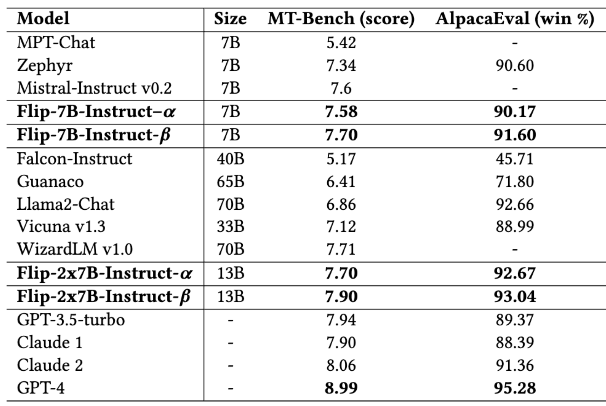

# KD-DAE: Knowledge Distillation and Domain Alignment from Expert

- **Knowledge Distillation (KD):** Leveraging KD, we propose an alternative to the commonly used supervised fine-tuning (SFT) and alignment process in language model training. 
- **Domain Alignment from Expert (DAE):** A unique post-training domain alignment algorithm designed to strengthen domain-specific knowledge within the LLMs.

Our proposed approach surpasses state-of-the-art language models, as evidenced by significant improvements in MT-Bench and AlpacaEval benchmarks.

## Experiments and Models

The suggested method primarily focuses on the transformers architecture. Our experiments are conducted on Mistral models, including:

- **Mistral 7B v0.1 Base**
- **Mistral Instruct v2**
- **Mixtral 8x7B Instruct**

These models share the same tokenizer, number of decoder layers, and attention heads, facilitating straightforward distillation with a one-to-one mapping. However, adjustments can be made as long as the tokenizer of the teacher and student models is the same. Our study mainly focuses on the prediction layer and attention-based distillation. Although hidden states-based distillation could yield good results, we couldn't extensively explore it due to its high memory demands.

## Results

### MT-Bench

  

<i>Figure 1: MT-Bench result by category.</i>

### Evaluation

  

<i>Figure 2: Comparing MT-Bench and Alpaca Eval score with other proprietary and large LLMs.</i>

## Conclusion

We propose knowledge distillation as a legitimate means of model training rather than a mere way to compress larger LLMs for deployment purposes. We demonstrate that our models are either comparable to or, in some cases, even outperforms open-access and proprietary much larger LLMs trained using the popular SFT and alignment approach. While we acknowledge the importance of SFT and alignment in training LLMs, we advocate for our KD-DAE approach as a viable training method for models that could benefit from superior teachers.
